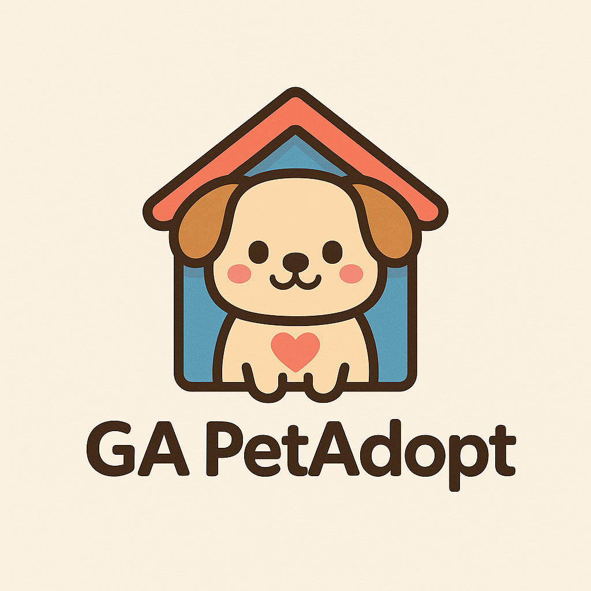

[#Back End](#back-end)
[github-pet_adoption_server](https://github.com/Yusuf-ALmahroos/pet_adoption_server)

[#FRONT END](#front-end)
[github-pet_adoption_client](https://github.com/Yusuf-ALmahroos/pet_adoption_client)

#back-end🔧
- [🎨 Front End](#front-end)

# Pet Adoption Server

This is a backend server for a pet adoption platform, built with Node.js, Express, and MongoDB (Mongoose). It provides a RESTful API for managing users, pets, adoption requests, and comments.

## Features

*   **User Management**:
    *   User registration and login.
    *   Password hashing and JWT-based authentication.
    *   Update user passwords.
    *   Session checking.
*   **Pet Management**:
    *   Create, read, update, and delete pet listings.
    *   View all available pets.
    *   View pets owned by a specific user (shelter owner).
*   **Adoption Requests**:
    *   Users can create adoption requests for pets.
    *   View personal adoption requests.
    *   Shelter owners can view and respond to adoption requests for their pets (approve/reject).
    *   Pets are marked as `isAdopted` upon approval of a request.
*   **Comments**:
    *   Users can create comments on pet listings.
    *   View comments for a specific pet.
    *   Update and delete personal comments.

## Technologies Used

*   **Node.js**: JavaScript runtime environment.
*   **Express.js**: Web application framework for Node.js.
*   **MongoDB**: NoSQL database.
*   **Mongoose**: ODM (Object Data Modeling) library for MongoDB and Node.js.
*   **Bcrypt**: For password hashing.
*   **jsonwebtoken**: For JWT (JSON Web Token) based authentication.
*   **Dotenv**: To load environment variables from a `.env` file.

## Project Structure

```
     controllers/           Contains the business logic for API endpoints
         AdoptController.js     Handles adoption request related operations.
         AuthController.js      Manages user authentication (registration, login, password updates).
         CommentController.js   Manages comments on pet listings.
         PetController.js       Handles pet listing operations (create, read, update, delete).
     db/                    Database connection setup
         index.js               Establishes connection to MongoDB.
     middleware/            Authentication middleware
         index.js               Contains middleware for JWT verification and other authentication checks.
     models/                Mongoose schemas for data models
        AdoptionRequest.js      Defines the schema for adoption requests.
         Comment.js             Defines the schema for comments.
         Pet.js                 Defines the schema for pet listings.
         User.js                Defines the schema for user accounts.
     routes/                Defines API routes and links to controllers
         AdoptionRequestRouter.js  Routes for adoption request endpoints.
         AuthRouter.js          Routes for authentication endpoints.
         CommentRouter.js       Routes for comment endpoints.
         PetRouter.js           Routes for pet listing endpoints.
     .env.example           Example environment variables file
     package.json           Project dependencies and scripts
     README.md              This file
     server.js              Main server entry point, sets up Express app and routes.
```
## Setup and Installation

1.  **Clone the repository**:
    ```bash
    git clone https://github.com/Yusuf-ALmahroos/pet_adoption_server.git
    cd pet_adoption_server
    ```
2.  **Install dependencies**:
    ```bash
    npm install
    ```
3.  **Environment Variables**:
    Create a `.env` file in the root directory and add the following:
    ```
    MONGODB_URI=your_mongodb_connection_string
    SALT_ROUNDS=10 # Or any integer for bcrypt salt rounds
    APP_SECRET=your_jwt_secret_key
    ```
    Replace `your_mongodb_connection_string` with your MongoDB connection URI (e.g., `mongodb://localhost:27017/petadoption`).
    Replace `your_jwt_secret_key` with a strong, random string.

4.  **Start the server**:
    ```bash
    node server.js
    ```
    The server will typically run on `http://localhost:3000` (or the port configured in `server.js`).

## API Endpoints

Below is a summary of the main API endpoints. All authenticated routes require a JWT in the `Authorization: Bearer <token>` header.

### Authentication (`/auth`)

*   `POST /auth/register`: Register a new user.
*   `POST /auth/login`: Log in a user and receive a JWT.
*   `PUT /auth/update/:user_id`: Update user password (authenticated).
*   `GET /auth/session`: Check user session (authenticated).

### Pets (`/pets`)

*   `GET /pets`: Get all pets.
*   `GET /pets/me`: Get pets owned by the authenticated user (shelter owner) (authenticated).
*   `GET /pets/:id`: Get a pet by ID (authenticated).
*   `POST /pets`: Create a new pet listing (authenticated).
*   `PUT /pets/:id`: Update a pet listing (authenticated, owner only).
*   `DELETE /pets/:id`: Delete a pet listing (authenticated, owner only).

### Adoption Requests (`/adoption-requests`)

*   `POST /adoption-requests`: Create a new adoption request (authenticated).
*   `GET /adoption-requests/my`: Get adoption requests made by the authenticated user (authenticated).
*   `GET /adoption-requests/received`: Get adoption requests received for the authenticated user's pets (authenticated, owner only).
*   `GET /adoption-requests/respond/:requestId`: Respond to an adoption request (approve/reject) (authenticated, owner only).

### Comments (`/comments`)

*   `POST /comments`: Create a new comment on a pet (authenticated).
*   `GET /comments/pet/:petId`: Get all comments for a specific pet.
*   `PUT /comments/:commentId`: Update a comment (authenticated, owner only).
*   `DELETE /comments/:commentId`: Delete a comment (authenticated, owner only).

## Usage Example (using `curl`)

### Register a User

```bash
curl -X POST -H "Content-Type: application/json" -d '{"name": "John Doe", "email": "john@example.com", "password": "password123"}' http://localhost:3001/auth/register
```

### Login a User

```bash
curl -X POST -H "Content-Type: application/json" -d '{"email": "john@example.com", "password": "password123"}' http://localhost:3000/auth/login
```
(This will return a JWT token that you can use for authenticated requests)

### Create a Pet (as a shelter owner)

```bash
curl -X POST -H "Content-Type: application/json" -H "Authorization: Bearer <YOUR_JWT_TOKEN>" -d '{"name": "Buddy", "type": "Dog", "breed": "Golden Retriever", "age": 2, "description": "Friendly and playful.", "image": "http://example.com/buddy.jpg"}' http://localhost:3000/pets
```

### Create an Adoption Request

```bash
curl -X POST -H "Content-Type: application/json" -H "Authorization: Bearer <YOUR_JWT_TOKEN>" -d '{"petId": "60c72b2f9b1e8c001c8e4d7a", "message": "I would love to adopt Buddy!"}' http://localhost:3000/adoption-requests
```


#front-end🎨
- [🔧 Back End](#back-end)

# GA Pet Adoption Client

This is a React-based front-end application for a pet adoption platform. It allows users to view available pets, register, log in, add new pets for adoption, edit pet details, submit adoption requests, and manage their user profile.

## Features

- **User Authentication:** Register, Login, and Update Password functionality.
- **Pet Listing:** View a list of available pets, categorized by type (Dogs, Cats, Birds, Other Animals).
- **Pet Details:** View detailed information about individual pets, including descriptions and images.
- **Add/Edit Pets:** Authenticated users can add new pets to the platform and edit existing pet details.
- **Adoption Requests:** Users can submit adoption requests for available pets.
- **User Profile:** View adopted pets and manage user-specific information.
- **Comments:** Users can leave comments on pet profiles.
- **Responsive Navigation:** A navigation bar that adapts based on user login status.

## Technologies Used

- **React:** A JavaScript library for building user interfaces.
- **React Router DOM:** For declarative routing in React applications.
- **Axios:** A promise-based HTTP client for making API requests.
- **CSS:** For styling the application.

## Project Structure

The project follows a standard React application structure:

```
    public/                 Static assets like images.
         Pet Adaption Logo.png  Application logo.
     services/              API service configurations.
         api.js             Configures the Axios instance for making API requests to the backend.
    src/                    Main application source code.
        App.css             Global CSS styles for the application.
         App.jsx            The main application component, handling routing and user state.
         main.jsx           Entry point for the React application, renders the App component.
         components/        Contains reusable UI components.
         AddPetForm.jsx         Form for adding new pet listings.
         AdoptionRequestForm.jsx  Form for submitting adoption requests.
         CommentSection.jsx     Component for displaying and adding comments on pet profiles.
         EditPetForm.jsx        Form for editing existing pet details.
         LoginForm.jsx          Form for user login.
         Nav.jsx                Navigation bar component, adapts based on user login status.
         PetCard.jsx            Component to display individual pet information in a card format.
         RegisterForm.jsx       Form for new user registration.
         UpdatePasswordForm.jsx  Form for updating user passwords.
      pages/                Contains components representing different views or pages of the application.
         AddPet.jsx             Page for adding a new pet.
         EditPet.jsx            Page for editing a pet.
         Home.jsx               Home page displaying available pets.
         Login.jsx              Login page.
         Pet.jsx                Detailed view page for a single pet.
         Register.jsx           Registration page.
         UserProfile.jsx        User profile page to view adopted pets and manage information.
      styles/               Contains CSS files for styling various components and pages.
         AddPetForm.css
         AdoptionRequestForm.css
         EditPetForm.css
         home.css
         LoginForm.css
         Nav.css
         pet.css
         petCard.css
         RegisterForm.css
         UpdatePasswordForm.css
     .gitignore             Specifies intentionally untracked files to ignore.
     index.html             The main HTML file served by the development server.
     package.json           Project dependencies and scripts.
     README.md              This file.
     vite.config.js         Configuration file for Vite, the build tool.
```

## Setup and Installation

1.  **Clone the repository:**
    ```bash
    git clone https://github.com/Yusuf-ALmahroos/pet_adoption_client.git
    cd pet_adoption_client
    ```

2.  **Install dependencies:**
    ```bash
    npm install
    ```

3.  **Start the development server:**
    ```bash
    npm run dev
    ```
    The application will typically run on `http://localhost:5173` (or another available port).

## Usage

- Navigate to the home page to view available pets.
- Use the navigation bar to log in, register, or access other features.
- Logged-in users can add new pets or manage their profile.

## API Endpoint

The application interacts with a backend API running at `http://localhost:3000`. Ensure the backend server is running for full functionality.
